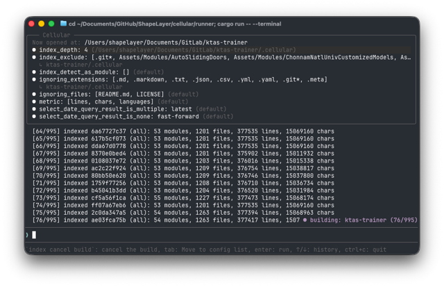
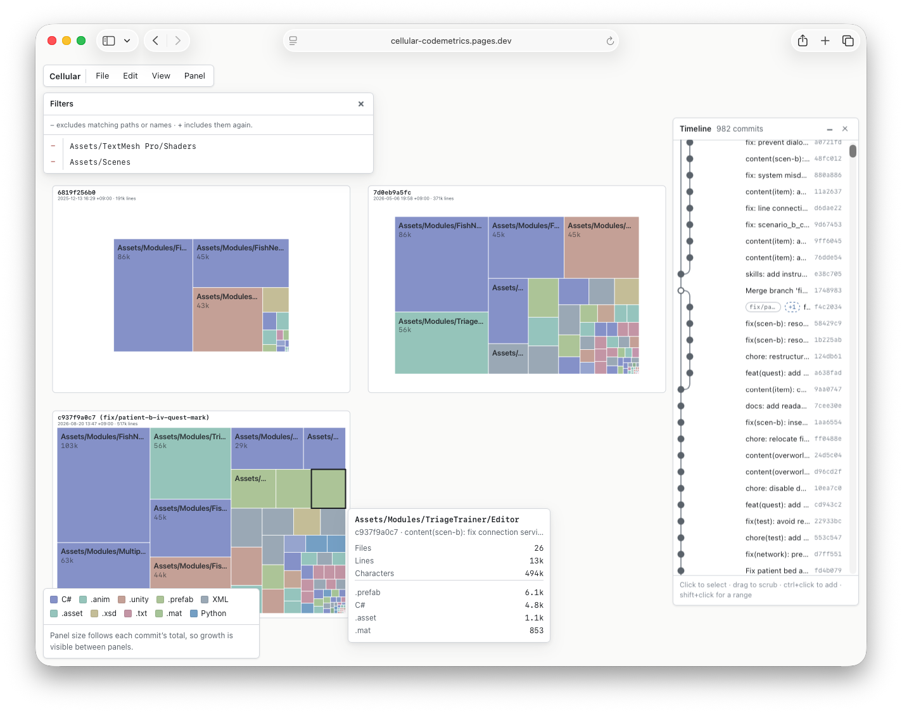

# Cellular

  
  

Cellular parses your project's source code and groups it by structure (typically at the module directory level) to display it as a heatmap graph. By visualizing data across multiple commits, you can track the quantitative evolution of your project over time.

## Getting Started

Clone this repository and execute the runner. The runner analyzes the project to generate statistical data, such as lines of code (LOC) per module and language distribution.

You can launch the runner's TUI with the following command:

```bash
cargo run -- --terminal
```

<br />

Once the TUI is running, you can enter the following commands:

```
cd <project-path>
index build <commits>
index export
```

The `index build` command reads the project and saves the statistics in the `cellular` directory within the user's home space. This data can then be exported into a file compatible with the viewer using the `index export` command.

`<commits>` can be specified using commit hashes, branch names, tags, `HEAD`, or a specific date using the `date:YYYY-MM-DD` format.

```
index build HEAD~10..HEAD
index build aaaaaa,bbbbbb,cccccc
index build date:2026-01-01,date:2026-06-01,main
```

<br />

Data exported via `index export` can be loaded into the viewer. You can access the viewer at [https://cellular-codemetrics.pages.dev](https://cellular-codemetrics.pages.dev).
